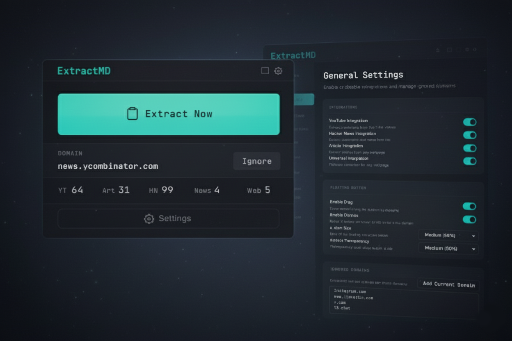
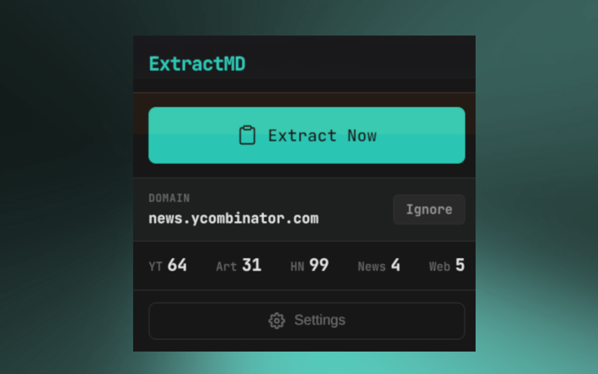
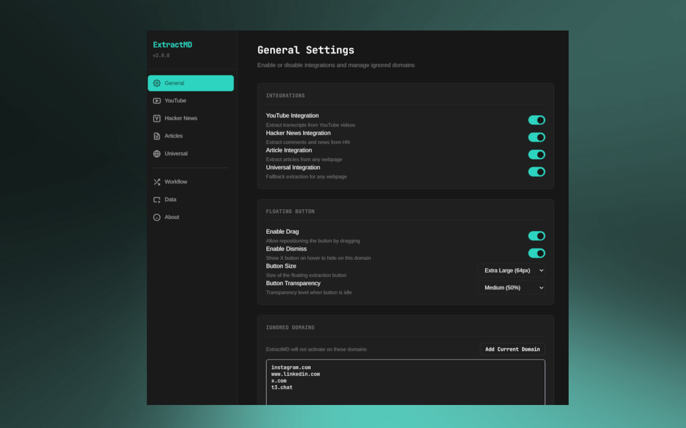

# ExtractMD

<div align="center">
  
</div>

<div align="center">
  <p>A Chrome extension that extracts content as Markdown from YouTube videos, Hacker News, articles, and any webpage. Features a floating button interface, comprehensive settings, and modular architecture.</p>
</div>

## Links

- **Website**: [https://extractmd.miguelcorderocollar.com/](https://extractmd.miguelcorderocollar.com/)
- **Chrome Web Store**: Pending approval

## Features

### Integrations

- **YouTube** - Extract video transcripts with customizable formatting (timestamps, title, channel, URL)
- **Hacker News** - Copy news lists or full comment threads as Markdown
- **Articles** - Convert readable articles to Markdown with optional image support
- **Universal** - Fallback HTML-to-Markdown converter for any webpage with configurable content selection

### Core Features

- **Floating Button** - Appears on supported pages with visual states (idle, loading, success, error)
- **Keyboard Shortcut** - `Ctrl+Shift+E` (or `Cmd+Shift+E` on Mac) to trigger extraction
- **Smart Download** - Auto-download when content exceeds configurable token threshold
- **Usage Tracking** - KPI counters for each integration type
- **Domain Ignore** - Per-domain toggle to disable extraction
- **Settings Import/Export** - Backup and restore your configuration
- **Last Extraction Status** - Shows recent extraction activity in popup
- **Jump to Domain** - Automatically open a custom URL (e.g., ChatGPT) after copying
- **Close Tab After Extraction** - Optional automatic tab closure
- **Token Counting** - Optional GPT token count display in notifications

### Universal Extraction Settings

- **Content Mode** - Auto-detect, full page, main element, or custom CSS selector
- **Custom Selector** - Specify exact element to extract
- **Strip Navigation** - Remove nav, header, footer, and sidebar elements
- **Include Options** - Images, links, page URL
- **Preserve Code Blocks** - Format code with syntax highlighting hints

## Installation

1. Clone the repository
2. Install dependencies: `pnpm install`
3. Build the extension: `pnpm run build`
4. Load `extension/` folder in Chrome via `chrome://extensions/` (Developer mode)

## Usage

### On Supported Pages

- **YouTube Video** - Floating button appears in bottom-right. Click to copy transcript as Markdown.
- **Hacker News** - On news or item pages, floating button copies news list or comments as Markdown.
- **Articles** - On readable articles, floating button copies article as Markdown (optionally with images).
- **Any Webpage** - Universal fallback extracts main content as Markdown (if enabled).

### Quick Actions

- **Popup** - Click extension icon for quick actions: Extract Now, domain toggle, KPI summary, last extraction status
- **Options Page** - Right-click extension icon → Options for comprehensive settings management
- **Keyboard Shortcut** - Press `Ctrl+Shift+E` to trigger extraction on current page

<div align="center">
  
  <p><em>Popup interface with quick actions and KPI summary</em></p>
</div>

<div align="center">
  
  <p><em>Comprehensive settings page with all configuration options</em></p>
</div>

## Development

```bash
# Run unit tests (Vitest)
pnpm test

# Build for production
pnpm run build:prod

# Watch mode (auto-rebuild)
pnpm run watch

# Package extension for Chrome Web Store
pnpm run package
```

### Packaging

The packaging script (`scripts/package.js`) prepares the extension for Chrome Web Store submission:

- Runs production build automatically
- Verifies all required files are present
- Checks for source maps (excludes them from ZIP)
- Validates manifest.json references
- Creates a versioned ZIP file in `packages/` directory
- Provides warnings for files larger than 10MB

The generated ZIP file (`packages/extractmd-{version}.zip`) is ready for upload to the Chrome Web Store Developer Dashboard.

## Architecture

- **Modular Design** - Shared components and utilities in `extension/shared/`
- **Manifest V3** - Modern Chrome extension standard
- **Test-Driven** - 203 unit tests (Vitest)
- **Bundled with esbuild** - Source files in `extension/`, bundled output in `extension/dist/`

## Project Structure

```
extension/
├── content/          # Content scripts (YouTube, HN, Articles, Universal)
│   ├── components/   # FloatingButton component
│   └── handlers/     # Copy/download handlers
├── popup/            # Popup UI modules (quick actions, KPIs, domain toggle)
├── options/          # Options page modules (full settings management)
├── shared/           # Shared components, defaults, storage utilities
└── dist/             # Bundled output (generated)
```

## License

MIT
